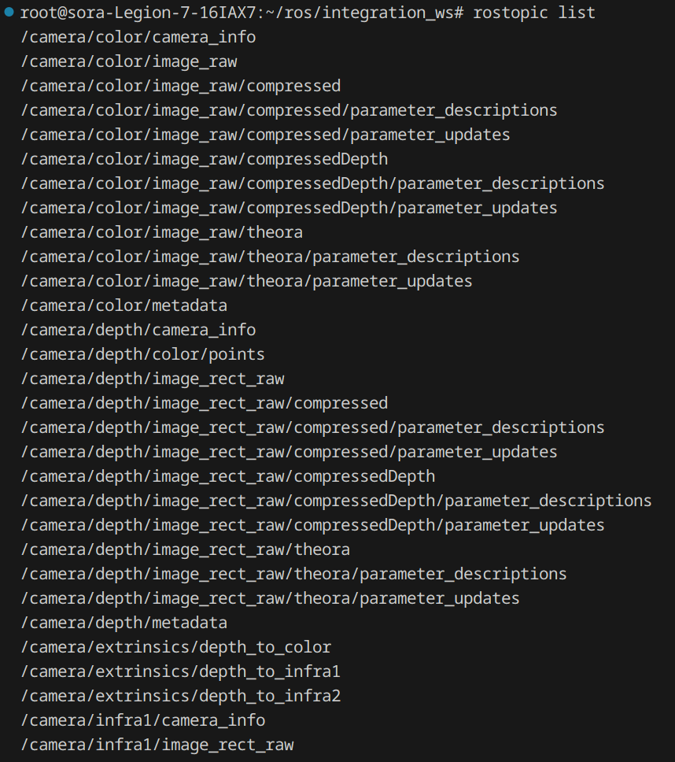
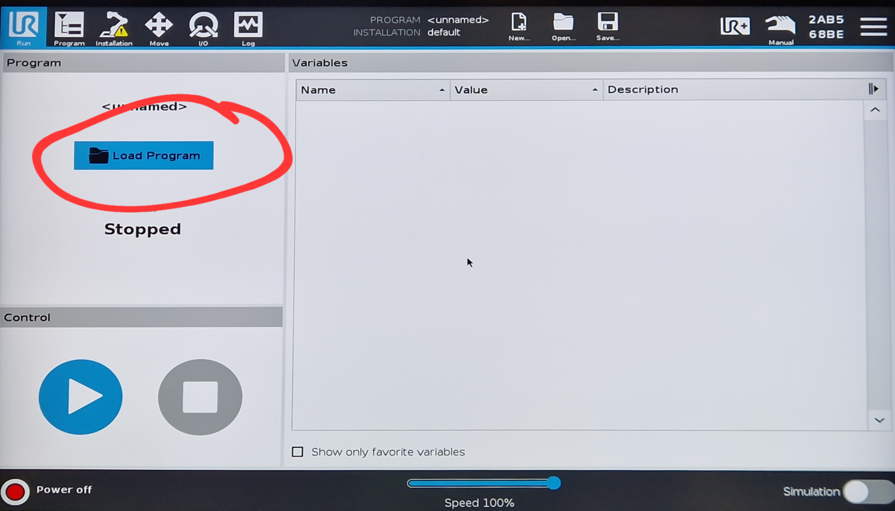
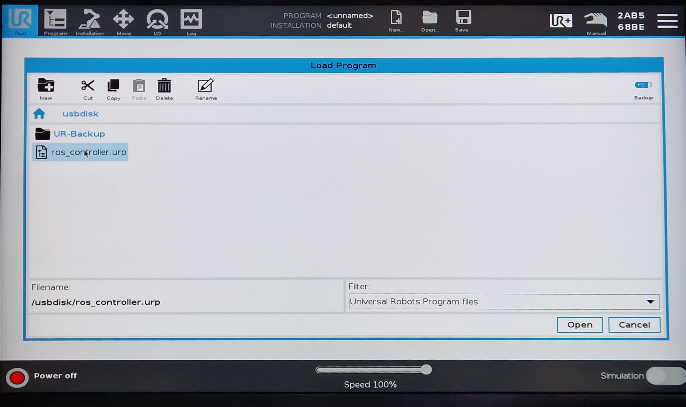
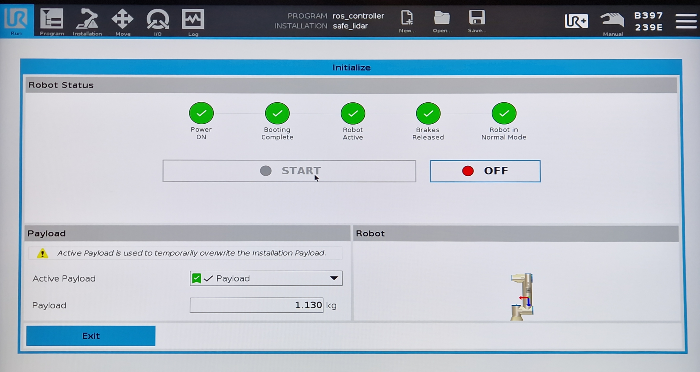
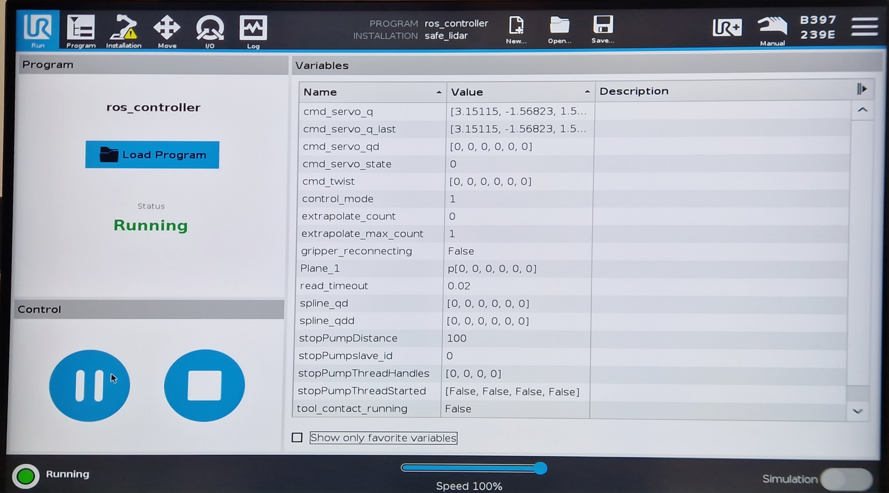
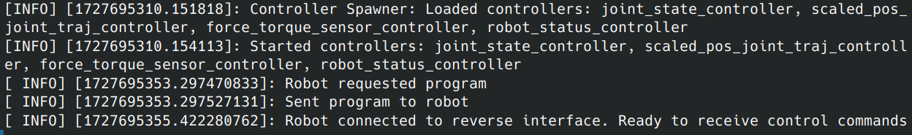
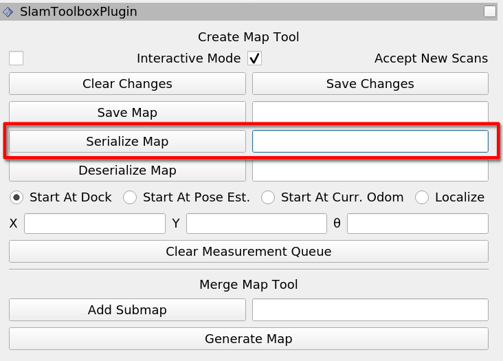
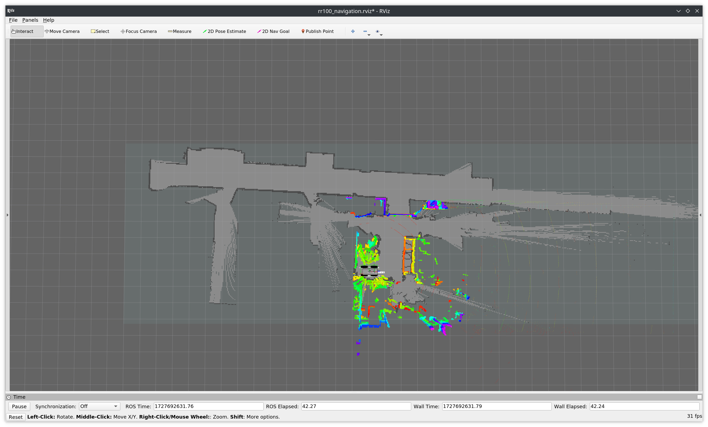
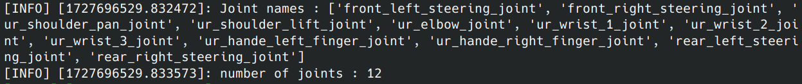
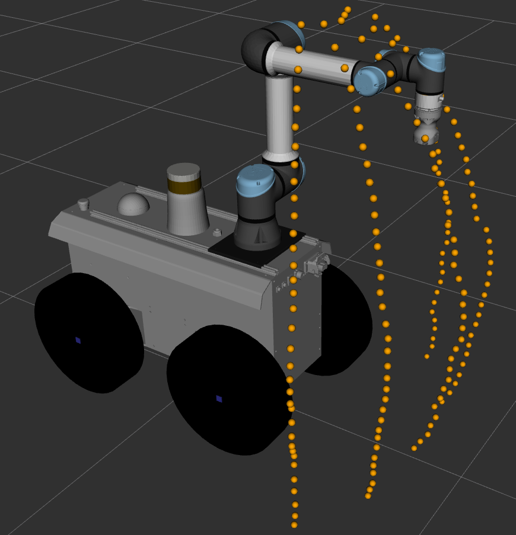

# Tutoriel d'utilisation du projet
## Pré-requis

Commencer par installer l'extension `Dev Containers`:
- Presser `Shift + Ctrl + X` pour ouvrir le marketplace des extensions de VS Code
- Rechercher l'extension `Dev Containers` dans la barre de recherche et l'installer (nécessite une installation de `Docker`)

## Installation et build du projet
Récupérer le projet depuis le github et lancer VS Code dans le répertoire récupéré :
```bash
git clone git@github.com:Soralsei/rr-ur-integration.git
code rr-ur-integration
```
Ensuite, lancer le `Dev Container` inclus en faisant :
- Presser `Shift + Ctrl + P` pour ouvrir la palette de commande
- Taper `Dev Container: Reopen In Container` dans la palette de commande
  
Cette commande va rouvrir le projet dans un conteneur Docker capable d'exécuter le projet. Cette étape risque de prendre quelques minutes lors de la première exécution afin de construire le conteneur Docker. Quand le build du conteneur termine, il faut ensuite build le projet et sourcer le script de setup :
```bash
catkin_make
source devel/setup.bash
```

## Utilisation
Afin de pouvoir exécuter les noeuds ROS de ce projet sur le robot réel, il faut tout d'abord sourcer le script `setup_roscore_robot`:
```
source setup_roscore_robot <IP de l'interface connectée au robot>
```

Pour vérifier que tout est bien configuré, exécuter la commande `rostopic list` et vérifier que les topics du RR100 sont bien affichés :



### Bringup du robot
#### Initialisation de l'UR5e
Pour initialiser le bras robot, il faut d'abord charger le programme de contrôle externe par ROS situé dans la clé USB connectée au boîtier de contrôle du bras `usbdisk/ros_controller.urp`:




Ceci va charger un programme ainsi qu'une configuration de sécurité du bras. Ensuite, on peut démarrer le bras en cliquant sur le bouton (actuellement rouge) en bas à gauche de l'écran et en cliquant ensuite sur `On` puis sur `Start`. Lorsque le bras aura démarré vous devriez avoir un écran ressemblant à ceci :


#### Initialisation des systèmes de contrôle
Commencer par se connecter en SSH au RR100 et rentrer le mot de passe quand demandé :

```
ssh user@rr-100-07
```

Ensuite, se déplacer dans le répertoire du projet (normalement déjà présent sur le robot) et sourcer le script de setup si le workspace est déjà built :

```
cd rr-ur-integration
source devel/setup.bash
```
Sinon, si le projet n'est pas déjà compilé, se déplacer dans les répertoire `rr100-rhoban`, supprimer les dossiers `devel` et `build`, compiler ce workspace et enfin sourcer le fichier de configuration généré :
```
cd ~/rr100-rhoban
rm -rf devel build
catkin_make
source devel/setup.bash
```

Ensuite, faire de même pour le répertoire `ur5-rhoban` et enfin le répertoire `rr-ur-integration`.

Pour initialiser le robot, lancer la commande suivante :
```bash
roslaunch rr100_ur_bringup robot_bringup.launch \
    controller_config_file:=$(rospack find ur5e_gripper_description)/config/ur5e_controllers.yaml \
    robot_ip:=192.168.1.5 \
    kinematics_config:=$(rospack find ur5e_gripper_description)/config/ur5e_factory_calibration.yaml \
    use_tool_communication:=false \
    prefix:=ur_
```

Quand tous les noeuds sont lancés, on peut retourner sur l'interface de l'UR5e et lancer le programme de contrôle :



Et sous ROS, on devrait avoir une sortie de ce type :



### Cartographie et navigation
Pour lancer les systèmes de cartographie et de navigation sans carte initiale, lancer la commande suivant :
- soit sur le robot directement (en ssh) :
```
roslaunch rr100_ur_navigation navigation.launch use_static_map:=false use_rviz:=false
```
puis en lançant Rviz en local `rviz -d $(rospack find rr100_navigation)/rviz/rr100_navigation.rviz`

- soit en local sur le Dev container:
```
roslaunch rr100_ur_navigation navigation.launch use_static_map:=false
```

Lorsque l'on est satisfait de la carte générée, il est possible de la sérialiser de deux manières différentes :
- En utilisant le plugin de RViz de `slam_toolbox`



- en appelant le service `/slam_toolbox/serialize_map`:

```
rosservice call /slam_toolbox/serialize_map "filename: '<nom de la carte>'" 
```

La carte sérialisée est sauvegardée dans le dossier `$HOME/.ros/` par défaut sous la forme de 2 fichiers :
- `<nom de la carte>.posegraph`
- `<nom de la carte>.data`

Pour relancer le système de navigation avec une carte sérialisée, on peut utiliser la commande précédente avec des arguments différents :
- Sur le robot, lancer :
```
roslaunch rr100_ur_navigation navigation.launch use_static_map:=true generate_map=[true|false] map_path:="<chemin vers la carte sérialisée>/<nom de la carte sans extension>" use_rviz:=false
```
et ensuite lancer Rviz en local `rviz -d $(rospack find rr100_navigation)/rviz/rr100_navigation.rviz`

- En local, lancer:
```
roslaunch rr100_ur_navigation navigation.launch use_static_map:=false use_rviz:=false
```



### Serveur de cinématique inverse
Pour lancer le serveur de cinématique inverse du projet, lancer la commande suivante soit directement sur le RR100, soit en local :
```
roslaunch ur5_kinematics ur5_kinematics.launch link_prefix:=ur_ base_frame:=base_footprint
```

La sortie de cette commande de lancement devrait être de cette forme :


### Serveur de placement de la base
Pour lancer le serveur de placement de la base robot, lancer la commande suivante soit directement sur le RR100, soit en local :
```bash
roslaunch rr100_ur_placement rr100_ur_placement.launch \
    workspace_config_path:=$(rospack find rr100_ur_description)/config/reachable_points.json \
    footprint_topic:=/move_base_rr100/global_costmap/footprint \
    map_topic:=/map
```
L'argument `workspace_config_path` est requis, et correspond à un fichier JSON qui contient une liste de couches de points permettant de représenter l'espace de travail de l'UR5e fixé au dos du RR100. Le serveur recoit des requêtes sur le service `/robot_base_placer/get_placement` par défaut. Pour effectuer ce placement, le serveur discrétise l'espace de recherche de pose permettant d'atteindre une cible avec le bras robot grâce aux points fournis en configuration et choisi une la pose à atteindre grâce à une heuristique simple (distance pondérée entre position/orientation actuelle à la pose candidate). Le serveur expose les poids utilisés pour le scoring des candidats en paramètre que l'on peut set lors du lancement de la commande précedente grâce aux arguments `position_weight` et `orientation_weight`.

Le serveur de placement devrait publier les points qu'il a reçu en entrée dans le topic `/ur_workspace_points`, visualisable sur RViz :



### Contrôleur du robot
Pour lancer le contrôleur du robot, lancer la commande suivante soit directement sur le robot, soit en local :
```bash
roslaunch rr100_ur_worker controller.launch \
    ik_action:=/kinematics_server/goal_pose \
    joint_trajectory_action:=/ur/scaled_pos_joint_traj_controller/follow_joint_trajectory/
```
Il est possible de spécifier les noms des différents services et actions en tant qu'arguments de cette commande, dans le cas ou ceux-ci viendraient à changer.

Le contrôleur complet du robot fonctionne comme une queue de tâches à effectuer. Par défaut, le contrôleur reçoit les tâches dans les topics `/compound_tasks` pour les tâches complexes (composées de plusieurs tâches) et `/tasks` pour les tâches simples.

